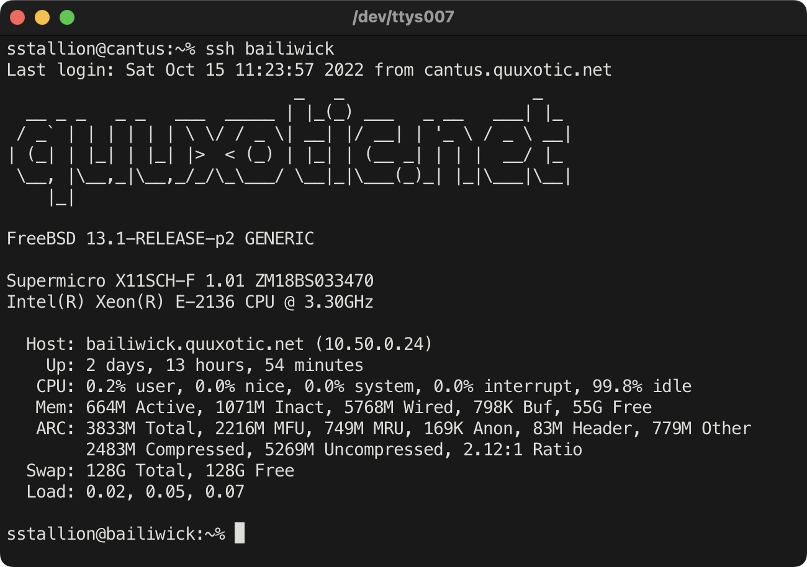

# Dynamic /var/run/motd

[][1]
[][2]
[][3]

`dynamic_motd` is a drop-in replacement for generating dynamic messages of the
day on FreeBSD 13.0 or later. During system startup, the file `/var/run/motd`
is replaced with a fifo whose content is generated by a user-configurable shell
script that is executed on each login. All other aspects of [motd(5)][4] are
preserved.

See [Configuration](#configuration) for more details.

    

## Installation

### FreeBSD Packages

The `dynamic_motd` package can be installed by issuing:

    # pkg install dynamic_motd

### FreeBSD Ports

The `sysutils/dynamic_motd` port can be installed by issuing:

    # cd /usr/ports/sysutils/dynamic_motd
    # make install clean

### From Source

Installing from source should be avoided unless testing changes that have not
yet been released downstream. By default, files will be installed in
`/usr/local`, however this can be changed by specifying the `PREFIX` variable.

    # git clone https://github.com/sstallion/dynamic_motd.git /usr/local/src/dynamic_motd
    # cd /usr/local/src/dynamic_motd
    # make install

## Configuration

The `${PREFIX}/etc/rc.motd` script is responsible for generating content for
`/var/run/motd` on each login. A sample script is provided in
`${PREFIX}/etc/rc.motd.sample` that emulates the default [motd(5)][4] behavior.
More extensive examples can be found in `${PREFIX}/share/examples/dynamic_motd`.

To enable the `dynamic_motd` service, `update_motd` should be disabled in
`/etc/rc.conf` as it is no longer needed at system startup:

    # sysrc update_motd="NO"

The `dynamic_motd` service can then be enabled by issuing:

    # sysrc dynamic_motd="YES"
    # service dynamic_motd start

> **Note**: `${PREFIX}/etc/rc.motd` can be updated without restarting the
> `dynamic_motd` service; changes are automatically picked up on next login.

## Contributing

Pull requests are welcome! See [CONTRIBUTING.md][5] for more details.

## License

Source code in this repository is licensed under a Simplified BSD License. See
[LICENSE][3] for more details.

[1]: https://github.com/sstallion/dynamic_motd/actions/workflows/ci.yml
[2]: https://github.com/sstallion/dynamic_motd/releases/latest
[3]: https://github.com/sstallion/dynamic_motd/blob/master/LICENSE
[4]: https://www.freebsd.org/cgi/man.cgi?query=motd&manpath=FreeBSD+13.0-RELEASE+and+Ports
[5]: https://github.com/sstallion/dynamic_motd/blob/master/CONTRIBUTING.md
